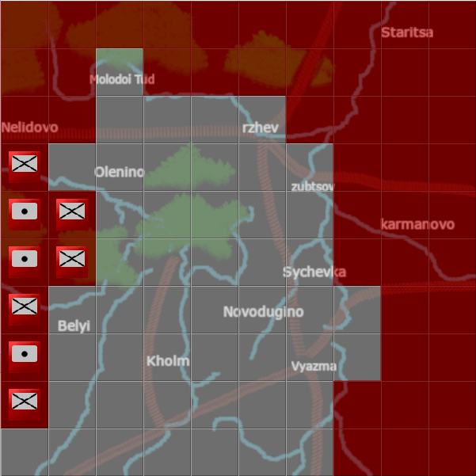

# Online Turn-Based Multiplayer Game
This project will be a two-player online multiplayer strategy game, created in Java. The game will be turn-based, 
and will be set in WW2 and focused on Operation Mars, a famous operation on the eastern front around the city of Rzhev.



## Getting Started (Software Based)

### Prerequisites
What do I need in order to get your project running? For example,
* IntelliJ Idea 2016 (or later)
* Image editing software

### Installing

The game can presently be run from the command line or from the IntelliJ IDE

#### Run from Command Line


#### Install libraries and run program

```
gson 2.8.2
```

### Running Tests

Tests are currently built-in and will simply print values to the IntelliJ console. Otherwise, testing the game involves running and attempting to play it in various ways.

### Versioning Statergy
I will use semantic versioning for my software.

## Getting Started (Hardware Based)

### Pre-requisites

Working modern computer capable of running Windows 7 or later, with network connectivity, and capable of running IntelliJ Idea 2016 or later

## Credits
Provide your names here
* Sarmed Alwan - Programming and Art
* Bensound - Music [2]
* Richard Ampleford - Music

## References
* 1 - [Java and the Windows Command Line](https://introcs.cs.princeton.edu/java/15inout/windows-cmd.html)
* 2 - [Bensound Music](https://www.bensound.com/royalty-free-music/track/instinct)