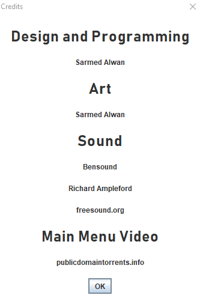

# Online Turn-Based Multiplayer Game
This project is a two-player online multiplayer strategy game, created in Java. The game is turn-based, 
and is set in WW2 and focused on Operation Mars, a famous operation on the eastern front around the city of Rzhev.

The project contains about 1500 lines of code, and two dozen assets.

This Readme contains the technical documentation, followed by the user manual.


## Credits



**Credit also goes to Project Supervisor Professor Anthony Vickers and Second Assessor Carmine Ventre**

## Design of the Game

The game requires two players. One plays as the Soviets, and one plays as the Germans. The game is based on the historical battle Operation Mars. The users can click on units and move them in alternating turns.
Opposing units can engage in combat against each other. Each unit has a health value. The specific rules of the game will be decided and implemented in further versions. The units represent historical divisions,
which were thousands of men in strength historically. The players' territories will shift when their respective units move into their respective territories. A player must oppose and defeat the other player.

# Technical Documentation

## Technical Review
### Structure of the Program

The program is built with the following structure. The white arrows represent one part leading to or creating another, the black arrows represent one part being a part of another, and the grey arrows represent communication between parts.


The class which the .jar file first leads to is the Main class, which only contains the ‘main’ method. This method simply sets the last moved player as 2, so that Player 1 will always go first, and then opens the main menu, in the form of MenuFrame.

* MenuFrame is a JFrame made up of MenuElements, which is a panel containing the menu’s elements. MenuFrame creates MenuElements, which has 4 buttons on it; Join Game, Host Game, Credits, and Quit
* Clicking Credits will create creditsPanel, and open a JOptionPane message dialog, which will contain the panel. The message dialog can be closed by clicking ‘OK’
* On MenuElements, clicking the Quit button will close and terminate the program
* Clicking Host Game will start a server. The server will simply wait to receive connections. When a connection is received, the server will run a new ServerThread to listen to and communicate with that given client
* If the Join Game button is clicked on MenuElements, the MainFrame will be created
* MainFrame will create a MainPanel and add it to itself
* The MainPanel will create 4 other panels and add them to itself. These 4 panels will make up the game display, and are layered on top of each other with OverlayLayout
* Background is a panel which simply loads and displays the background map
* GridPanel is a panel which creates and displays the game’s grid lines
* TerritoriesPanel is a panel which creates and displays the two players’ territories as coloured squares
* UnitPanel is the panel which displays the players’ units and handles their movement
* These four panels are created by, and come together to form, MainPanel
* MainPanel also initiates and runs ClientThread, a thread which will listen to and communicate with the server on behalf of the client
* ServerThread and UnitPanel communicate back and forth with ClientThread
* The Selection class simply contains the currentSelected method. The class is invoked by the game logic, mainly within UnitPanel.
* GameState is essentially a utility class; it initialises and stores the game state, calculates combat, and some other small tasks. 
* ServerThread, TerritoriesPanel, and UnitPanel communicate back and forth with GameState, such as to request combat calculations or the initial state of the game board.
* UnitPanel and TerritoriesPanel communicate with each other to update the territory board.
* The Unit class is not part of the ‘structure’ per se, as it simply defines the Unit object and allows it to be modified.

### Purpose and Functionality of the Program Classes
#### Main

The Main class is the initialising class of the whole program, and is the one that is run when the .jar file is run. The class’s only method - main - sets GameState’s stored lastMovedPlayer variable to 2 so that the first player will always be 1. The method then creates the frame for the main menu, and gives it a title:
new MenuFrame("Operation Mars");

#### Unit

The Unit class defines the Unit object, which is the most important object in the program, and represents one of the players’ units which they control. The class implements the Serializable interface, meaning that it can be serialised, which is necessary for the transmission of unit information over the Java socket system used in this program, because the system uses Gson, a Java library which can serialise objects into their Json representation. The class declaration begins with the class variables, which make up the definition of a unit: icon, iconFileName, name, xLocation, yLocation, health, vet, type, faction, and selected. The variable icon is a BufferedImage, and directly stores the image icon associated with the Unit object, such as the following:


This doesn’t include the veterancy counter or the health bar, which are rendered in-game from values rather than loaded in or stored. This variable is transient, meaning that it is left behind when serialisation is performed, because otherwise an error would occur, because BufferedImage objects can’t be serialised. The variable iconFileName stores the name of the image file of the icon. This not only allows the initial icon to be loaded from the file location, but also allows the icon to be easily re-loaded from the same location once the Unit object has been serialised and then de-serialised and the original icon has been left behind. The icon simply loads the image from the media folder using the Unit object’s iconFileName and the ImageIO class.

xLocation and yLocation are simply ints (integers) which store the unit’s current X and Y coordinates on the game board. These will range from 0-9, as there are 10 squares on the board and the index starts at 0.
The variable type is a String which stores the type of the unit. This string’s values can be either “inf”, “art”, or “arm”. This type is given to the unit at the start of the game and never changes.
health is an integer which starts at 100, and stores the unit’s current health. This is the only one which is set by default in the constructor rather than being passed into it, because new units always start with 100 (full) health.
name is a String which stores the unit’s historical name, such as “11th Cavalry Corps”. This is only for historical flavour, and has no impact on the functioning of the game. 
faction is an int which stores the unit’s faction, either 1 or 2, meaning either Soviets or Germans. This determines which player the unit belongs to.
selected is a Boolean (true or false) signalling whether or not the given unit is currently selected. If it is, it will get a white highlight rendered around it to show this. By default, selected is of course false.
vet stores the ‘veterancy’ of the unit (how experienced it is) as an int value. This affects the unit’s combat abilities; higher veterancy will give them an advantage in combat.

The primary constructor for the unit takes the iconFileName, xLocation, yLocation, type, faction, vet, and selected arguments. They are received when the game is first started, from the GameState class. It sets them in the corresponding values in the Unit object, and sets health to 100 as mentioned above.

The copy constructor is below the primary constructor and can be identified by the fact that it takes only a Unit object as its argument, rather than a series of features of the Unit. The copy constructor simply takes a unit object and copies it into a new one by copying all of its attributes one by one into the new object. The icon is not directly copied, but rather inferred from the iconFileName variable of the object being copied.

Following the copy constructor are a series of ‘getter’ and ‘setter’ methods, which simply return and modify the attributes of the Unit object. Two examples are below:

`int getHealth(){return health;}`

If [unit’s name].getHealth is invoked, the int health of that unit will be returned.

`void setHealth(int newHealth){ this.health = newHealth; }`

If [unit’s name].setHealth is invoked, the int health of that unit will be set to whatever is passed into the invocation as an argument. The method is void because it doesn’t return anything.

The setIcon() method stands out in these ‘getter’ and ‘setter’ methods as slightly more complex. It contains a try/catch block to catch an IOException if the image file is not found from the file name. It reloads a unit’s icon based on its stored file name when it has just been de-serialised.

#### MenuFrame

The MenuFrame class defines the MenuFrame object, which is extended from the JFrame class. This means that it is a subclass of the JFrame class, and extends it to create a new object. It receives the String argument title from the Main method. The ‘super’ call at the start of the constructor calls the super class’s constructor to set the title of the window (frame) to whatever was received from Main, in this case simply “Operation Mars”. The default close operation is set to terminate the whole program. This may be inconvenient if the user wishes to close the main menu window after launching the program, but it means that there won’t be the case of the program not actually terminating if the user doesn’t open the game frame and close the program from there. The MenuFrame then creates a MenuElements object, and uses BorderLayout to add the new object to the centre of itself.


#### MenuElements

The MenuElements object class extends from the JPanel class and implements the ActionListener interface. The ActionListener interface allows it to contain interactive buttons. The panel MenuElements constitutes all of the elements of the main menu, and is added to the frame MenuFrame, which holds and displays it. The file song.mp3 is loaded into a MediaPlayer at the start of the class, so that it can be played on the main menu. The void method getPreferredSize() tells Java that the menu should start at a certain size. In this case, that size is 1104x832, which is the original size of the background video. The JFXPanel is declared outside and then inside the constructor, because without the seemingly redundant declaration outside, it doesn’t work. The cycle count of the MediaPlayer is set to “INDEFINITE,” meaning that the song will loop indefinitely when it finishes. Its volume is set to 0.3, meaning 30% of the original.

The music is then played, and the background file is loaded as a StretchIcon (meaning that it will stretch to fill the frame, so the user can resize the menu and the GIF background will respond). The icon of the panel is then set to the StretchIcon, meaning that the StretchIcon will appear in the background of the panel and be directly part of it. This is contained within a try/catch block so that a missing file won’t throw an unhandled IOException.

```
try {
   StretchIcon image = new StretchIcon(this.getClass().getResource("/media/"+fileName));
   this.setIcon(image);
   this.setVisible(true);
} catch (Exception e) {
   System.out.println("Background file not found");
}
```


The panel’s layout is set to GridBagLayout, which allows its elements to be laid out with coordinates like a grid. This allowed for the buttons and text to be laid out neatly in the desired way. A GridBagConstraints object is declared to allow for defining the layout and location of each element of the menu. The anchor attribute of the GridBagConstraints object defines where on the panel the elements will be placed from, and the insets attribute defines the padding around each element. The North argument means that the elements should be centred horizontally. The title and buttons are then created, and are laid out one by one onto the panel using the GridBagConstraints, with coordinates for each one. For example:

```
gbc.gridx = 0;
gbc.gridy = 4;
this.add(hostGame, gbc);
```

This places the hostGame button at position 0,4 relative to the starting position, which is in the top centre (so it will be 4 spaces down from the top centre). Some of the insets are also modified between each element.

The buttons all have String arguments which define their actions when clicked. For example, the Host Game button has the action “host”:

```
JButton hostGame = new JButton("Host Game");
hostGame.addActionListener(this);
hostGame.setActionCommand("host");
```

When the button is clicked, it will call the action listener implemented by the containing class (i.e. this) and the action listener will see that the action is “host”, and act accordingly:

```
} else if ("host".equals(e.getActionCommand())) {
   if(!GameState.getServerHosted()) {
       new Server().start();
       GameState.setServerHosted(true);
       JOptionPane.showMessageDialog(null, "You are now hosting a game. To join your own game, click Join Game and press Enter", "Game Hosted", JOptionPane.INFORMATION_MESSAGE);
   } else{
       JOptionPane.showMessageDialog(null, "Game already hosted. To join your own game, click Join Game and press Enter", "Game Already Hosted", JOptionPane.INFORMATION_MESSAGE);
   }
```

As can be seen, there is also an implementation to avoid the hosting of two servers on one client, which would cause an error. In this case, a message dialog comes up to warn the user. The same is done in the case of the user trying to launch the game twice from the same client.

The openCredits() method is called when the Credits button is clicked, and creates a message dialog with a custom panel embedded onto it. This panel is also written using the GridBagLayout. The lines of text are all defined at the top, and then laid out one by one in the same fashion that the main menu itself is laid out. The background is then changed to white and the panel is displayed on a MessageBox which comes up when the Credits button is clicked.

`JOptionPane.showMessageDialog(this,creditsPanel,"Credits", JOptionPane.PLAIN_MESSAGE);`

#### MainFrame

The MainFrame class is like the MenuFrame class in that it extends from the JFrame class. Its main jobs are to play the game’s music and to hold the main panel which houses the game itself. It initialises the MediaPlayer in the same way as the MenuFrame, and plays the game music at volume 0.2 (20%). It creates MainPanel and sets MainPanel’s layout to OverlayLayout, which will allow it to layer its constituent panels on top of each other. This frame’s default close action will also close the program as a whole, so if the user clicks the X button on the window then the program will terminate. The MainPanel is added to the centre of MainFrame using BorderLayout.

```
LayoutManager overlay = new OverlayLayout(main);
main.setLayout(overlay);
setLayout(new BorderLayout());
getContentPane().add(main, BorderLayout.CENTER);
```


#### MainPanel

MainPanel is an object class which extends JPanel. It contains all of the other panels which make up the game: Background, GridPanel, TerritoriesPanel, and UnitPanel When an instance of it is created, it receives as arguments the containing frame and the IP which the user entered, so that the IP can be passed to the client thread to connect to the server. The frame is received as an argument so that the MainPanel can change the frame’s title at initialisation when the game starts, to include the player’s faction and whose turn it currently is (always the Soviet player’s turn initially). The frame is then passed to UnitPanel, which further changes the frame title as appropriate as the game goes on, such as when turns change. This is performed here rather than in the frame constructor because it must be performed after the player number has been received from the server by the ClientThread.

```
if (GameState.getFaction() == 1) {
   frame.setTitle("Operation Mars | Faction: Soviets | Your Turn");
} else if (GameState.getFaction() == 2) {
   frame.setTitle("Operation Mars | Faction: Germans | Opponent's Turn");
}
```


MainPanel’s main duties are to create the 4 panels of the game, and then to add them to itself. It also creates and runs the ClientThread, which communicates with the server on the client’s behalf. The panels are added in the following order:

```
this.add(BorderLayout.CENTER, unitPanel);
this.add(BorderLayout.CENTER, territoriesPanel);
this.add(BorderLayout.CENTER, gridPanel);
this.add(BorderLayout.CENTER, background);
```


Because MainPanel (this) is in OverlayLayout (as set previously in MainFrame) this order of the adding of the panels is important, and means that unitPanel will visually be in front, with territoriesPanel behind, then gridPanel, then background. The units sit on top of the territory and are displayed first and foremost. The background panel, on its creation, is passed the file name of the map image file, in this case operationmarsmap.png. This tells the background panel where to look for the image file which will display the background of the game, i.e. the map with the towns etc.


#### UnitPanel

UnitPanel contains most of the code for the rendering of, movement, and interaction between the units in the game. It also handles most of the sound effects, as these also occur via the units. The class extends JPanel, and within it is defined the class Listener which extends MouseInputAdapter and handles the user’s mouse clicks and movements and their effects. UnitPanel has a lot of class variables, since it has a variety of methods which need constant shared access to most of them. Variables w and h are ints and define the width and height of the game grid, and are assigned the number 10 in the panel’s constructor. Variable faction tells the panel which faction the player belongs to; 1 or 2. totalVPs and totalEnemyVPs are used to store the last calculated figure for each player’s victory points.
The floats mainGraphicsAlpha and combatAnimationAlpha are used to store the alpha values for the composites of the graphics, such as the ‘your turn’ message and the combat explosion image. These control the transparencies of the graphics, so they can fade in or out. The Unit objects hurt1 and hurt2 store copies of the units which the opponent just made fight, and the objects combatant1 and combatant2 store copies of the units which the player just made fight. These variables allow for appropriate animations and sounds etc to be used. The int size dictates the pixel size of each tile, and if this is altered then the size of the game could be changed, though a proportionally larger background map would need to be used, or the same image could be stretched
The ArrayList gameGrid is two-dimensional (ArrayList of ArrayLists) and each ArrayList stores 10 Unit objects, resulting in a 2D 10x10 grid which stores the units of the game in their current state.
The Boolean variables won and lost simply record whether or not the client has won the game, and whether or not they have lost. If both values are false, which is the default, then the game has not yet ended.
The Unit object selected stores a copy of the currently selected unit; this is so that the selected object can be operated upon without the original object on the game grid being modified.
Color transparent holds a colour object which has no RGB values and an alpha value of 0 (the last argument), meaning that it is transparent. This is used to make the background of the unit panel transparent so that the lower layers can show through behind it.

`Color transparent = new Color(0,0,0,0);`

territories stores a 2D array of ints indicating the current layout of the two players’ territories, so that they can be checked and modified, and sent to the territories panel. territoriesPanel stores a reference to the territoriesPanel created in mainPanel’s constructor. This allows unitPanel to interact with it. In much the same way, frame and mainPanel store references to the main frame and the main panel so that unitPanel can interact with them.
The JFXPanel fxPanel needs to be created for the media players to work, though it isn’t used itself.
There are a series of Media objects which hold the references to the sound effects for the MediaPlayers to use. They are declared as such.

`Media turnSound = new Media(getClass().getResource("/media/yourturn.mp3").toString());`

They contain string arguments referring to the file paths of their corresponding sound effect, which are all stored in the media folder, like the graphical assets.
The MediaPlayers are then declared to utilise these Media objects like so:

`MediaPlayer turnSoundPlayer = new MediaPlayer(turnSound);`

The UnitPanel class’ constructor first sets the UI background to black and the foreground to white, mainly affecting the colour of the tooltips. It then makes itself focusable and grabs the program’s focus, so that it can be interacted with by the user. It assigns all of the received arguments to its own variables declared above, like so:

`this.frame = frame;`

The w and h variables are then set to 10, representing the width and height of the game grid. The last moved player is set to 2, so that Player 1 always goes first, and then the volume of all of the sound effects’ media players is set to 0.7 (70%), to be louder than the music.

The paintComponent method tells the UnitPanel how to render itself.
First, it sets the panel’s opacity to false so that it is transparent to the panels beneath it. Three Graphics2D objects are created; mainGraphics, combatGraphics, and endGameGraphics. The mainGraphics object is used to draw the ‘YOUR TURN’ message and the opponent’s combat animations. The combatGraphics object is used to draw the client’s combat animations, and the endGameGraphics object is used to display the ‘YOU WON’ and ‘YOU LOST’ messages to the client.
The board is updated from the one stored in GameState, and an embedded For loop begins to cycle over every tile in the game and render it.
If a unit exists (isn’t null), has more than 0 health, and is nearby, then it should be rendered:

`if (gameGrid.get(i).get(j) != null && gameGrid.get(i).get(j).getHealth() > 0 && GameState.isNear(gameGrid.get(i).get(j), gameGrid)) {`

If that unit is selected, then a white rounded rectangle should first be drawn under it, whose edges will appear around the unit’s edges.

```
if (gameGrid.get(i).get(j).getSelection()) {
   g.setColor(Color.WHITE);
   g.fillRoundRect((gameGrid.get(i).get(j).getxLocation() * size) + 8, (gameGrid.get(i).get(j).getyLocation() * size) + 8, 44, 44, 10, 10);
}
```


The rectangle is drawn at the unit’s location multiplied by the pixel size of each grid square, plus 8 pixels so that it isn’t right at the edge of the grid square, because we want the rectangle to be in the middle with some space around it for the user to be able to see the map behind it. 44 is the pixel width and height; again, smaller than the grid square. 10 represents the arc width and arc height of the curved corners of the rectangle.

The rendering loop then draws each unit icon in its corresponding place, in much the same way that the rounded rectangles are rendered above. The mainGraphics object then draws a green line over the top of the unit’s icon to represent its health; the arguments provided were obtained by trial and error to try to position the line so that when health is 100, the line symmetrically spans from the top left of the unit icon to the top right, with space on the sides.


The loop then checks what the unit’s current veterancy is, and writes it in the bottom-left of the unit icon. If the veterancy is 1 or 2, it is written in bronze, if it’s 3 or 4 it’s written in silver, and in gold if it’s 5 or 6. This provides another visual aid for users to quickly see the value of a unit to them.

```
if (gameGrid.get(i).get(j).getVet()>0) {
   if (gameGrid.get(i).get(j).getVet()<=2) {
       mainGraphics.setColor(new Color(214,175,54)); //Bronze
   } else if (gameGrid.get(i).get(j).getVet()<=4) {
       mainGraphics.setColor(new Color(212,212,212)); //Silver
   } else if (gameGrid.get(i).get(j).getVet()>4) {
       mainGraphics.setColor(new Color(255, 223, 0)); //Gold
   } //Set the colour of the veterancy display to correspond with the amount of veterancy the unit has; bronze for 1-2, silver for 3-4, gold for 5-6
       mainGraphics.setFont(new Font("BahnSchrift", Font.BOLD, 12));
       mainGraphics.drawString(Integer.toString(gameGrid.get(i).get(j).getVet()), (gameGrid.get(i).get(j).getxLocation() * size) + 12, (gameGrid.get(i).get(j).getyLocation() * size) + 48);
       //Write the unit's veterancy over the bottom corner of its icon (+48 to Y puts it low down, +12 puts it a little bit to the right)
}
```


Once the unit rendering loop has completed, the method checks whether or not it’s the user’s turn, and whether or not the game has ended. If it is the user’s turn and the game hasn’t ended, the ‘YOUR TURN’ message rendering is executed, as well as the rendering of the opponent’s move.

```
if(GameState.getLastMovedPlayer()!=GameState.getFaction() && !(won||lost)) { //If the player wasn't the last to move and he has neither won nor lost
       AlphaComposite alCom = AlphaComposite.getInstance(
               AlphaComposite.SRC_OVER, mainGraphicsAlpha);
       mainGraphics.setPaint(Color.WHITE);
       mainGraphics.setComposite(alCom);
       mainGraphics.setFont(new Font("BahnSchrift", Font.BOLD, 50));
```


An AlphaComposite object is created to utilise the alpha value to give the mainGraphics object a transparency, so that the combat graphic and the ‘YOUR TURN’ message can fade out. The alpha is reduced by a small amount, and then the painting is done again. This continues until the alpha reaches 0.

```
mainGraphicsAlpha -= 0.02f;
if (mainGraphicsAlpha <= 0.0f) {
   mainGraphicsAlpha = 0.0f;
} else {
   repaint();
}
```


If it isn’t the client’s turn and the game hasn’t ended, the frame’s title is updated to remind them of this. The second rendering section, which uses combatGraphics, simply renders the explosion effect for when the client makes two units fight, rather than when the enemy does so. It is executed in the same way as the previous method; a BufferedImage of the explosion is drawn, and then is slowly faded by reducing its alpha value and repainting. The location of the image is also chosen in the same way, with the coordinates being halfway between the two fighting units - taking one unit’s coordinates and adding half of the distance to the other unit, and adding an offset of 10 since the units also don’t start at the edges of the grid squares. This puts the explosion halfway between the two units.

```
BufferedImage explosion = ImageIO.read(getClass().getResource("/media/explosion.png"));
combatGraphics.drawImage(explosion, ((((combatant1.getxLocation()*size)+(combatant2.getxLocation()*size)))/2)+10, ((((combatant1.getyLocation() * size)+(combatant2.getyLocation()*size)))/2)+10, 40, 40, null);
```


Finally, if the player has won or lost, i.e. if the game is over, then either the ‘YOU WIN’ or ‘YOU LOSE’ message is rendered by endGameGraphics.

`if (won || lost){`

This doesn’t need to use an alpha value as it doesn’t need to fade at this point, since the game is over.

The deselect() method simply cycles through the 2D ArrayList of units in standard fashion - with an embedded for loop, and then sets each Unit object’s stored selection value to false:

`gameGrid.get(i).get(j).setSelection(false);`

setCombatants() is used to set which two units the client just made fight, so that the combat animation can be rendered between them:

```
combatant1 = new Unit(attacker);
combatant2 = new Unit(defender);
```


updateGrid() is used to update the grid of units when the opponent makes a move to match what the server says is the new state of the game grid.

Firstly, the method increments the turn counter and then checks if the opponent won the game during their turn. If this was the case, then the server will send an 11 if the opponent is player 1, and a 12 if the opponent is player 2. Therefore, if the opponent’s player number is greater than 2, then they must have won:

```
GameState.setTurnCount(GameState.getTurnCount()+1);
if (GameState.getLastMovedPlayer()>2){
   lost = true;
   repaint();
}
```

Next, an embedded for loop runs through the board. If any two opposing units from the newly received board have less health than their counterparts on the client’s board, then they are marked as ‘hurt’, meaning they’ve just fought and need to have a combat animation displayed between them:

```
if (newGrid.get(i).get(j).getHealth() < gameGrid.get(i).get(j).getHealth()) {
   try {
       if (hurt1 == null) {
           hurt1 = new Unit(newGrid.get(i).get(j));
       } else {
           hurt2 = new Unit(newGrid.get(i).get(j));
       }
   } catch (IOException e) {
       e.printStackTrace();
   }
}
```


Then, within the same embedded loop, each unit has its icon set via its built-in setIcon method, and then it is copied from the received board to the client’s own board.

```
   newGrid.get(i).get(j).setIcon(); //Sets the units' icons based on their icon file locations, since the icons themselves aren't sent over by the server
}
gameGrid.get(i).set(j, newGrid.get(i).get(j));
```


Then the ‘your turn’ sound effect is reset to the start and played to coincide with the start of the client’s turn:

```
turnSoundPlayer.seek(new Duration(0));
turnSoundPlayer.play();
```


The method updateTerritories also works by cycling through a 10x10 embedded for loop; it goes to each tile in the territories 2D array, and updates its value based on which unit is in that corresponding location on the unit grid (gameGrid). 1 is subtracted because the territories grid works with 0s and 1s rather than 1s and 2s, but it works in the same way; 0 is player 1’s territory, 1 is player 2’s territory.

```
if(gameGrid.get(i).get(j) != null) {
   territories[i][j] = gameGrid.get(i).get(j).getFaction() - 1;
}
```


The new territories grid is then saved to the one stored by territoriesPanel so that it can be rendered.

The playCombatSound method checks with 3 if statements which unit type the attacking unit is; “inf”, “art”, or “arm”, and plays the corresponding sound effect. For example:

```
if (attacker.getType().equals("inf")) { //If the attacker was infantry, play the infantry combat sound effect
   infSoundPlayer.seek(new Duration(0));
   infSoundPlayer.play();
}
```


playMovementSound works in exactly the same way, but plays the corresponding movement sound effect, like so:

```
if (selected.getType().equals("inf")) {
 infMoveSoundPlayer.seek(new Duration(0)); //If the moved unit was infantry, play the infantry movement sound effect
 infMoveSoundPlayer.play();
}
```


The getPreferredSize() method tells Java which size the unit panel should be; the preferred size is defined as the pixel size of a tile multiplied by the amount of tiles in the game:

`return new Dimension(w * size, h * size);`

#### Listener

Class Listener is defined within class UnitPanel, and is used to keep track of the user’s mouse movements and clicks within the game. The class extends MouseInputAdapter, and takes the unit panel as an argument. It overrides the methods of MouseInputAdapter: mouseClicked, mousePressed, mouseReleased, mouseEntered, mouseExited, mouseDragged, and mouseMoved. The only ones of these which contain code are mouseClicked and mouseMoved; the remaining ones do nothing. Method mouseClicked handles the user’s clicks and their effects, being the selection and control of units on the board, and mouseMoved simply handles the tooltips which appear when the user hovers over a unit.

When the mouse is clicked, the mouseClicked method is triggered, with MouseEvent e, which allows the mouse event to be further analysed, such as for coordinates. The method checks if the player has won or lost; if neither are true, this means the game is still going, and so it proceeds to process the user’s click. The method then checks if the user was the last player to move; if they were, then they can proceed, but otherwise the click isn’t processed because they just had their turn. There is only a console print command here, for debugging purposes. Having a message come up would be annoying to the user. If the click is processed, the grid coordinates of the user’s click are obtained by taking the pixel coordinates from the MouseEvent e, and dividing them by the pixel size of the grid squares:

```
int x = (e.getX() / size);
int y = (e.getY() / size);
```


Variables are also created to hold the previous coordinates of a unit, and the gameGrid and faction variables are updated from their storage in GameState:

```
int oldX;
int oldY;
gameGrid = GameState.getBoard();
faction = GameState.getFaction();
```


In the below loop, a 2D (embedded) for loop is used, so that each tile in the game grid can be checked one by one. The For loops run until the size of the grid (10) and are iterated by 1 each time. The if statement within checks if the user has clicked a unit (a non-null location) and the clicked unit is marked as selected within its object, it is copied into the selected variable to be operated on. Once the selected unit is copied, the embedded loop is broken using the SelectionLoop label. The loop is broken early because only one unit needs to be selected. Breaking early saves on extra CPU time.

```
SelectionLoop:
for (int i = 0; i < GameState.width; i++) {
   for (int j = 0; j < GameState.height; j++) {
       if (gameGrid.get(i).get(j) != null && gameGrid.get(i).get(j).getSelection()) {
           try {
               selected = new Unit(gameGrid.get(i).get(j));
           } catch (IOException e1) {
               e1.printStackTrace();
           }
           break SelectionLoop;
       }
   }
}
```


Following this is an if statement which sets the Unit in the game grid’s selection as true:

```
if (gameGrid.get(x).get(y) != null) {
   Unit selectedUnit = null;
   if (currentSelected(gameGrid) != null) {
      selectedUnit = currentSelected(gameGrid);
   }
   if (currentSelected(gameGrid) == null && gameGrid.get(x).get(y).getFaction() == faction) {
       gameGrid.get(x).get(y).setSelection(true);
   }
}
```


The selectedUnit object simply exists so that the reference can be handed to a persistent instance variable so that unit re-selection can happen smoothly without having to first deselect. If the first if statement inside the outer one is removed, the game still works, but it takes 2 clicks to switch unit.
Following this, an if statement checks if the user has clicked somewhere while a unit is selected:

```
if (selected != null){
   //If a unit is selected and you've clicked somewhere
   try {
```


The code that follows is the code for movement and combat. The processing only takes place if the move is legal, however, which is checked by a method in GameState:

`if (GameState.isLegal(selected, x, y)) { //If the move is legal (within 1 square, allowing diagonal movement for armour units)`

Following this, 3 scenarios are checked for: the user clicks an adjacent empty square, the user clicks an adjacent enemy, or the user clicks an adjacent ally.
In the case that the user clicks on an adjacent empty tile, the currently selected unit’s location is saved, then it is copied into the new location, and then the object at the old ArrayList location is deleted so that the unit is only in its new place and not in its old place. The territories 2D array is then updated from the one stored by the territoriesPanel, the unit’s new location is updated to belong to his faction territorially, and then the newly adjusted territories array is saved again to the territoriesPanel. The method for playing the unit’s movement sound effect is then called, and the if statement ends.
The second case is that the user clicks on an adjacent enemy unit. This is checked by the following if statement:

`} else if (gameGrid.get(x).get(y).getFaction() != faction) { //If the selected unit has been clicked onto an adjacent enemy unit`

If this happens, then the game handles combat and its effects. First, the territories array is updated from the one stored by territoriesPanel. Then, the combat simulation method is called, which is in the GameState class. The method modifies the two fighting units which are passed to it as arguments. Method setCombatants is then called with the two fighting units as arguments, so that the rendering code can know that two units have just fought, and which ones. This is followed by a call to repaint() so that the panel is redrawn and the combat animation can be shown. There are then two checks to the units’ health. If a unit has less than 1 health, i.e. it is dead, then it is removed from the board and its opposing unit is rewarded with 1 veterancy point, provided that its opposing unit still exists and has less than the maximum of 6 veterancy. If a unit dies, the opposing player is also granted 1 victory point here, regardless of whether or not their own unit also died. The combat sound effect method is then called, with the attacking unit as the argument, so that the appropriate corresponding sound effect can be played.

The third case is that an adjacent friendly unit is clicked:

`} else { //If a friendly adjacent unit is clicked, a swap will take place`

Like with the movement code, the selected unit’s old location is temporarily stored. The unit which was clicked (not the selected one) is also copied into a temporary Unit object using the Unit class’ copy constructor. The clicked Unit’s location is set to the selected Unit, and then the selected unit’s location is set to the clicked Unit. Territories don’t need to be updated because no territories would ever be changing hands in the event of a swap move.

The deselect() method is then called to make sure that after the click, whether it’s a move, an attack or a swap, the unit is deselected to prepare for the next turn. The alpha of the combat animation is then reset to 1.0 (100%) so that it appears, and then the turn counter is iterated by 1. Each of the two users’ victory points are calculated as the total of  the user’s victory points from unit kills and their victory points from controlled territory. If the turn count has reached 100, these two totals are compared, and the player with the higher total wins. The alpha for the main graphics (the Your Turn message and the combat animation) is then also reset to 1.0, in preparation for the next turn. Once these processes have been completed, the move is submitted to the server via the ClientThread, and the last player is set to the client’s faction because they just moved. The selected unit copy is reset to null, and the new board is saved to GameState.

The mouseMoved method handles the user’s mouse movements to provide them with tooltips when they hover over units. This is a useful way to give information such as unit names and specific health numbers without having to over-fill the GUI itself. When the user moves the mouse, the mouse’s grid coordinates are calculated in the same way as they are when the user clicks; by dividing the pixel coordinates by the pixel size of the grid squares. Then, if the user is hovering over a non-null square (one with a unit in it) and that unit is ‘nearby’ (within sight range of their own units), a corresponding tooltip will appear. The font is set to Microsoft’s Bahnschrift in bold with size 12, and the tooltip’s text is set to display the unit’s name, health, and veterancy. This is done by passing HTML code as the string argument to the setToolTipText() method, because otherwise the tooltip would not allow line breaks to be manually added. Using HTML here allows for line breaks to be added where aesthetically necessary, so that the tooltip can be compact and clear in its presentation of information, rather than spanning one long line.

```
component.setFont(new Font("BahnSchrift", Font.BOLD, 12));
String fontFamily = component.getFont().getFamily();
component.setToolTipText("<html><body style=\"font-family:" + fontFamily + "\"<b>" + gameGrid.get(x).get(y).getName() + "<br>" + "Health: " + gameGrid.get(x).get(y).getHealth() + "<br>" + "Veterancy: " + gameGrid.get(x).get(y).getVet() + "</b></html>");
```


The font of the text is set by the fontFamily part of the argument. If the user is hovering over an empty area or the unit isn’t nearby, the tooltip text is set to null, which means the tooltip won’t appear.


#### Background

The Background class is one of the 4 panel classes whose instances make up the MainPanel instance. Like the others, it extends the JPanel class. The class has 5 variables; w, h, size, image, and fileName. The ints w and h tell the panel which size the game grid’s width and height are in terms of tiles; in this case they are both 10. size is the pixel size of each grid square, which is 60. The BufferedImage image will hold the png image which is used as the background of the game, i.e. the map. The String fileName tells the Background object the file path of the png file.
The class only has two methods; the first is paintComponent, which loads the png file into image and draws image from the top-left corner of the panel (0,0).

```
image = ImageIO.read(getClass().getResource("/media/"+this.fileName));

g.drawImage(image, 0, 0, null);
```


The other method in the class is getPreferredSize(), which works the same as in the other panels; it uses the square size and the number of squares to determine the size of the panel. This size should come out the same as the other panels in mainPanel. The height is simply h*size, and the width is w*size.


#### GridPanel

GridPanel is another of the 4 panels making up mainPanel, and is approximately as simple as Background, and also extends the JPanel class. The class has 3 variables; w, h, and size. The ints w and h tell the panel which size the game grid’s width and height are in terms of tiles; in this case they are both 10. size is the pixel size of each grid square, which is 60. The paintComponent method performs an embedded for loop to cover each of the 100 grid squares, and for each coordinate it draws a rectangle at that grid square’s coordinates, using size as the height and width of the rectangles. This simply adds a line grid to the game to denote the locations of the squares.

The other method in the class is getPreferredSize(), which works the same as in the other panels; it uses the square size and the number of squares to determine the size of the panel. This size should come out the same as the other panels in mainPanel. The height is simply h*size, and the width is w*size.

#### TerritoriesPanel

TerritoriesPanel is the last of the 4 panels making up mainPanel, and is about as simple as the others, and also extends the JPanel class. The class has 5 variables; colors, territories, w, h, and size. The ints w and h tell the panel which size the game grid’s width and height are in terms of tiles; in this case they are both 10. size is the pixel size of each grid square, which is 60. The array colors holds two colours, which are essentially red and grey with an alpha value to make them transparent. The alpha value is set to 80 and can range up to 255, which would be completely opaque, or down to 0, which would mean totally transparent. In this case we want the territory colours to be apparent without blocking the layers beneath such as the map (background). The class’ paintComponent method does an embedded for loop through the 10x10 territories array, and draws a corresponding rectangle in the appropriate location, with the colour determined by whether that spot in the 2D territories array is a 0 or a 1; 0 referring to the index location of the red colour in the colors array, and 1 referring to the grey colour, i.e. Soviets are 0 and Germans are 1. 

```
for (int i = 0; i < w; i++)
{
   for (int j = 0; j < h; j++)
   {
       g.setColor(colors[territories[i][j]]);
       g.fill3DRect(i * size, j * size, size, size, true);
   }
}
```


The class also has a ‘get’ method and a ‘set’ method for the territories grid, called getTerritories and updateTerritories respectively. getTerritories simply returns the territories array, while updateTerritories uses the Arrays.copyOf() method to copy the new territories array - called owners - into territories.


```
public void updateTerritories(int[][] owners){
   territories = Arrays.copyOf(owners, owners.length);
}

public int[][] getTerritories(){
   return territories;
}
```

#### GameState

GameState is a class which manages the state of the game, including storing important values like the game board, and also centrally handling combat. Its class variables are width, height, size, gameBoard, faction, victoryPoints, enemyVictoryPoints, turnCount, territoryVictoryPoints, enemyTerritoryVictoryPoints, serverHosted, serverJoined, and someoneHasMoved. The ints width, height and size determine the grid width and height, and individual square pixel size, respectively. gameBoard is a 2D ArrayList which stores the board of Unit objects. The int faction stores which faction the player belongs to; 1 or 2, meaning Soviets or Germans. The four ints victoryPoints, enemyVictoryPoints, territoryVictoryPoints, and enemyTerritoryVictoryPoints hold the current values for how many points each player has from kills (victoryPoints and enemyVictoryPoints) and how many points each player has from held territories (territoryVictoryPoints and enemyTerritoryVictoryPoints). The Boolean values serverHosted, serverJoined, and someoneHasMoved allow the client to know what’s happened so far in the game; if the user has hosted or joined a server, they can’t host or join again. If someone has already moved, the server won’t accept any new connections to avoid conflicting information.

The getNewBoard() method creates the initial board of units to be used by the clients. It first uses an embedded for loop to fill an ArrayList with 10 ArrayLists, each with a capacity of 10 Unit objects. This forms a 2D 10x10 grid. Each of the 10 ArrayLists is then filled with 10 null values, which fills the whole grid, providing a blank slate for the units to be placed in their historical locations, so that the null places don’t have to be explicitly set one-by-one to null.

```
gameBoard = new ArrayList<ArrayList<Unit>>(10);
for (int i = 0; i < GameState.width; i++)
{
   gameBoard.add(new ArrayList<Unit>(10));
   for (int j = 0; j < GameState.height; j++)
   {
       gameBoard.get(i).add(null);
   }
}
```

The method then runs a Try block which contains a one-by-one definition of each unit as it should be in its historical location, with its own name, type, veterancy value, etc. There are 47 units defined and placed on the board for the Soviet player, and 26 for the German player. Below is an example of one of the unit placements.

```
Unit s1stMC = new Unit("1st Mechanised Corps", "sovietinfcounter", 0, 8, "inf", 1, 0, false);
gameBoard.get(0).set(8, s1stMC);
```


First, the unit is given an object name, and then is given its historical name to be displayed to the user, which image file it should use as its icon, which coordinates it’s at, which type of unit it is, which faction it belongs to (1 for Soviets, 2 for Germans), how much veterancy it has, and whether or not it is selected (this is false for all units at the start). Then, the unit is placed in its corresponding historical location in gameBoard. The icon image couldn’t just be inferred from the unit type, because some infantry units have a different icon - a horse’s head - for historical flavour, because they were cavalry divisions and are named as such. This also allows for future expandability, with different units possibly having unique or more varied symbols. Once the Try block has completed, the completed initialised gameBoard with all of the units in their historical locations is returned.

Following this method are simple get and set methods for 12 different variables. They all function in the same way, so here is one example:

```
static void setFaction(int newFaction){ faction = newFaction;}
static int getFaction(){return faction;}
```


The set method receives an argument and assigns its value to the corresponding variable. The get method just returns the corresponding variable.

The getTerritoryVictoryPoints and getEnemyTerritoryVictoryPoints methods are more complex than the other get methods, and involve a decent amount of calculation. The method getTerritoryVictoryPoints calculates how many victory points the player is currently gaining from towns that they hold, and getEnemyTerritoryVictoryPoints calculates the same but for the opponent. getTerritoryVictoryPoints sets the total to 0 to begin with, and then for each specific location where each town resides, if the player controls that location, 5 is added to the total. In the case of two locations - Rzhev and Vyazma, at positions (5,2) and (6,7), 10 is added rather than 5, because these are key towns and controlling them is more important than controlling peripheral villages.

`if (territories[2][1] == GameState.getFaction()-1) {territoryVictoryPoints += 5;}`

This check is performed for each town, and then the total is returned. getEnemyTerritoryVictoryPoints works in the same way, but calculates the points for the opponent instead. These could be merged into one method with else statements, but being separate methods allows for them to be called separately without one of them having to take slightly longer to get through the if statements to get to the else statements. It also makes for easier returning of the values, and makes the code more obvious in function.

The void combat method simulates combat between two units, and applies the resulting changes to their health. The two Unit objects are passed to the method, along with the territories board, which allows for encirclements to be taken into account. The int value standardDeviation, set to 8, determines how predictable the combat results will be; a lower value means more predictably-spread results. The combat calculation uses a Gaussian curve to determine each unit’s damage received, and 8 is the value of 1 standard deviation away from that curve’s mean average value. The typeBonus value determines how much of an impact having an appropriately matched unit - such as artillery versus their armour - will have on the enemy’s damage received. This is added to the mean damage, so that the average damage the armour would take in that case would be 35 higher. The townDefenceBonus value determines the usefulness of defending in a town. It is set to 15, so the attacker would have 15 added to their final damage number, and the defender would have 15 subtracted from theirs. The vetBonus value is also added/subtracted from the units’ damage at the end, and determines how much extra damage a unit takes and how much less it receives per level of veterancy it has. This is set to 5, so if a unit has 2 veterancy, it will deal 10 more damage and take 10 less. The encirclementPenalty represents the cost of being surrounded by enemy territory (diagonal territory not taken into account). The encircled unit will take this much more damage, and the other unit will have half of this value subtracted from its damage taken. It is set to 35, so an encircled unit who’d otherwise taken 50 damage would take 85 damage, and the opposing unit, if it had otherwise taken 50 damage, would take 34 damage (50-16).

The unit type penalty is determined by a series of if statements describing each of the 6 possible match-ups where a bonus would apply. An example is below.

`if (attacker.getType().equals("inf") && defender.getType().equals("arm")){attackerMean+=typeBonus;} //Infantry performs worse against armour`

As is apparent, when attacking infantry faces defending armour, the type bonus is added to the mean of the attacking infantry’s damage taken. Once this new mean is calculated, the random damage values are calculated for both units.

```
attackerLosses = (int)(random.nextGaussian()*standardDeviation+attackerMean);
defenderLosses = (int)(random.nextGaussian()*standardDeviation+defenderMean);
```


The veterancy bonuses are then applied as such:

```
attackerLosses -= attacker.getVet()*vetBonus;
defenderLosses += attacker.getVet()*vetBonus;
attackerLosses += defender.getVet()*vetBonus;
defenderLosses -= defender.getVet()*vetBonus;
```


Each unit’s veterancy bonus is added to their opponent’s damage, and subtracted from their own. The town defence bonus is then applied, wherein the defender’s location is checked against the locations of the game’s 12 towns:


```
if (((defender.getxLocation() == 2)&&(defender.getyLocation()==1))
       || ((defender.getxLocation() == 0)&&(defender.getyLocation()==2))
```

…

If there is a match, the town defence bonus is subtracted from the defender’s damage taken, and added to that of the attacker.

```
defenderLosses-=townDefenceBonus;
attackerLosses+=townDefenceBonus;
```


Four if statements then check whether the attacker is encircled, and then four others check the same for the defender. This is done by adding 1 to or subtracting 1 from each coordinate to check all 4 adjacent territories. If any of them is friendly, the unit isn’t encircled, but if none of them are, then the encircled value remains true. The encirclement penalty is then added to the damage taken of the unit which is encircled, and half of it is subtracted from the damage taken of the other unit.

```
//If attacker is encircled, make them take more damage and deal less
if (attackerEncircled){
   attackerLosses+=encirclementPenalty;
   defenderLosses-=encirclementPenalty/2;
}
```


The units are also made to take a minimum of 7 damage each turn, so that the game can’t be broken by extremely unlucky or lucky rolls, or a single high-veterancy unit having a snowball effect and wiping out 15 units.

```
if (attackerLosses<7){attackerLosses = 7;}
if (defenderLosses<7){defenderLosses = 7;}
```


Finally, the final changes to the units’ health are applied.

```
attacker.setHealth(attacker.getHealth()-attackerLosses);
defender.setHealth(defender.getHealth()-defenderLosses);
```


The getNewTerritories() method is similar to the getNewBoard() method in that it generates a new data structure for the game at the very start to set up the historical situation as it should be. In this case, it is a 2D array of ints rather than a 2D ArrayList of Units. As discussed earlier, a 0 in the territories array represents Soviet player control, and a 1 represents German player control. Since the Soviet player will hold most of the territory and the German player will only hold the central area, an embedded for loop first fills the 2D array with 0 values, and then a series of for loops fill certain lines of tiles with 1s to represent the German territory among the Soviet territory. For instance, the following loop fills the bottom (10th, i.e. index 9) row with 1s (German control) from index 0 (1st tile) to index 6 (7th tile). The remaining 3 tiles are left unaltered as 0s (Soviet control). This is repeated as necessary for all of the German territory.

```
for (int i = 0; i<7; i++){
   owners[i][9] = 1;
}
```


The updateBoard() void method updates the stored board from a new board by looping through each tile in the 2D ArrayList via an embedded for loop and copying the Unit object over if there is one:

```
if(gameBoard.get(i).get(j) != null && updatedBoard.get(i).get(j) != null) {
   try {
       gameBoard.get(i).set(j, new Unit(updatedBoard.get(i).get(j)));
   } catch (IOException e1) {
       e1.printStackTrace();
   }
}
```


The isLegal() method takes a Unit object and the coordinates it wishes to move to, and determines whether or not that move is legal. Legality means that the coordinates aren’t the same as the Unit’s current coordinates, and the unit is moving to an adjacent location. Armour units are allowed to move diagonally, so for them a simple if statement checks that the unit isn’t moving more than 1 tile. For non-armour units, there is an extra check added, to see that the x and y coordinates aren’t both changing, which would mean a diagonal move; only one coordinate can change for a cardinal (non-diagonal) move. Below is the legality check for non-armour units. The check for armour units is the same, but without the last condition that only one coordinate is changing.

```
} else if (!selected.getType().equals("arm") 
&& (!(Math.abs(selected.getxLocation() - x) > 1) 
&& !(Math.abs(selected.getyLocation() - y) > 1))
       && !((Math.abs(selected.getxLocation() - x) > 0) && (Math.abs(selected.getyLocation() - y) > 0))){
   return true;
}
```


The Boolean method isNear() takes a Unit and the unitBoard ArrayList, and checks if that given unit is adjacent to one of your (the player’s) units, including diagonal adjacency. Firstly, if the unit is one of yours, then true is automatically returned because your own units are inherently always near to your units. Then, all 8 adjacent locations are checked to see if there’s one of your units in one of them. If there is, then the unit is considered nearby because one of your units is there to see it, and true will be returned so that the unit is rendered. The if statements have conditions to make sure that none of the checks go outside of the board’s bounds and throw a NullPointerException. Below is an example of one of the 8 checks.

`|| (i<9&&j>0&&(unitBoard.get(i+1).get(j-1)!=null)&&unitBoard.get(i+1).get(j-1).getFaction()==faction)`

If none of these 8 checks are passed, the unit is considered not nearby, so false is returned.

#### Selection

The Selection class has only one method, and that method takes the gameBoard 2D ArrayList of Units and returns the Unit object which is selected. It performs an embedded for loop to cycle through the ArrayList, and then performs an if statement to check that a Unit exists there and is selected. If it is, true is returned. If the whole loop completes without true being returned, null is returned.

#### ClientThread

The ClientThread class extends the class Thread and is used to communicate back and forth with the server on behalf of the client. In its constructor, it first takes the three parameters passed to it - the territories panel, the unit panel, and the server’s IP, and assigns them to instance variables. Then, an int portNumber is assigned the value 8888 so that this port will be used for the connection. A high-numbered port was chosen so that it wouldn’t conflict with anything else. A new Gson object is then created for later serialisation and deserialisation in the communication with the server. A Socket object is created using the provided IP address and the port number, which creates a connection to the server at that IP’s location and on that socket. A BufferedReader and PrintWriter are created to read from the socket connection and write to it. A 2D ArrayList has a fresh board copied to it from GameState.getNewBoard(), and then this is saved as the current game board. The player’s assigned faction is received from the server and read via the BufferedReader, and saved. The Boolean serverJoined in GameState is also flagged as true to record that the client has already joined a server, so they can’t join again. Finally, the last moved player is set to 2 so that player 1 will always go first.

The ClientThread’s run() method is where the thread’s socket communication takes place from the server to the client. The method runs a while loop wherein it listens for lines of communication from the server. These are the int value of the player who just moved, and a Json string of the 2D game grid (ArrayList), serialised via Gson. The int is first listened for, and then it is saved as the last moved player. Then the board is listened for, and is deserialised via Gson, and then saved as the updated board. Then, if the client isn’t the one who just moved, his local grid and territories are prompted to refresh, and the other things that go with the start of one’s turn will be triggered from there.

The makeMove() method is where the client’s socket communication takes place from the client to the server. The method receives the client’s new board, and sends to the server the client’s player number, and the board, serialised via Gson:

```
public static void makeMove(ArrayList<ArrayList<Unit>> unitBoard){
   out.println(GameState.getFaction());
   Gson gson = new Gson();
   out.println(gson.toJson(unitBoard));
}
```


#### Server

The Server class extends the Thread class and is used to accept and open socket connections with clients who try to join the server. The thread is run when the user clicks the Host Game button on the main menu. The thread creates a socket at port 8888, then waits indefinitely, and when a client connects to the server, it accepts the socket connection and adds it to an ArrayList of connections, so it can know how many players are connected. It then starts a new ServerThread to communicate with that client, and sends it the new client’s Socket object, and the ArrayList of all of the Socket objects.

#### ServerThread

The ServerThread class extends the Thread class and is used to communicate over the socket to the client on behalf of the server. Its constructor simply receives the parameters passed to it by Server, and assigns them to instance variables. Like ClientThread, the run() method uses for communication a PrintWriter, an OutputStream, and a BufferedReader. Firstly, the thread prints the size of the ArrayList of socket connections to the output stream, so that the user joining can be told their player number based on the order in which they joined. Then, the last moved player is set to 20, so that the thread can know when it’s the first turn of the game. Then, the communication loop begins, and loops indefinitely. Within here, the thread uses the BufferedReader to receive communication from the client. Once it receives communication from the client, it can save the fact that someone has moved, so that it won’t accept any more socket connections after that. Then an if statement checks if the following communication should be relayed to the client. The communication is sent to the client in the event that either they just sent it themselves to the server, or it is the first turn, or either of the players has won the game, in which case both players need to be informed.

`if (factionWhoMoved == lastMovedPlayer || lastMovedPlayer == 20 || factionWhoMoved == 11 || factionWhoMoved == 12) {`

Within this statement, the server thread then cycles through every connection one by one and informs every other client on the server of the changes which have happened; these being the new board, and the player who updated the board, i.e. who made the move. This is done on the condition that the client isn’t the one who just moved, via the line: if (index != factionWhoMoved). After this is completed, the player who just moved is saved as the last moved player so that the process can repeat with the next received communication.


```
for (Socket socket : sockets) { //For all of the connections
   index++;
   if (index != factionWhoMoved) {
       OutputStream outputStr = socket.getOutputStream();
       PrintWriter printWriter = new PrintWriter(outputStr, true);
       printWriter.println(factionWhoMoved); //Tell the client who moved
       printWriter.println(playerBoard); //Tell the client the new state of the board
   }
}
lastMovedPlayer = factionWhoMoved;
```


## User Manual

### System Requirements

Minimum Specifications

CPU: Intel® Core™2 Duo Processor E8400 or AMD® Athlon X2 6000+ Processor or Equivalent
RAM: 2GB
GPU: Intel® HD Graphics 2000 or Equivalent
Operating System: Microsoft® Windows® 7
Storage: 200MB
Java SE Runtime Environment 8

Recommended Specifications

CPU: Intel® Core™ i5-2400 or AMD® FX-4300 or Equivalent
RAM: 4GB
GPU: Intel® HD Graphics 2000 or Equivalent
Operating System: Microsoft® Windows® 10
Storage: 200MB
Java SE Runtime Environment 8

## Getting Started

### Getting Online

If both players wish to play on the same machine, you do not need anything other than the game itself. If you wish to play Operation Mars over a remote internet connection, the recommended way is to download Virtual Private Network software such as LogMeIn Hamachi, and host your own Virtual Private Network. LogMeIn Hamachi can be downloaded for free at the following location:
https://www.vpn.net/
LogMeIn Hamachi is the property of LogMeIn Inc. and is not affiliated with Operation Mars. You may use another similar program if you know how to use it for the same purpose.
Create an account and begin the application. Click Network -> Create a New Network, and then type in the Network Name and Password which you would like to use. Do not use sensitive information here, as you will be sharing this information with whoever you wish to join your game server.
Your friend should click Network -> Join an Existing Network
They should then type in the network name and password which you chose, and click Join. Once the connection has been established, the IP to be used for the game should be visible (may be labelled as IPv4).

The game is distributed as a .jar file called Operation Mars.jar. To play the game, run the file by double-clicking it or right-clicking it and clicking Open. One of you should click Host Game, and then close the message which comes up. If you wish to both play on the same machine, you can open the file twice to open two instances of the game, and as usual only one of them should host. Once one of the players has hosted, the other should click Join Game, and enter the IPv4 address given by Hamachi, and then click OK. If you are both playing on the same machine, you don’t need to enter anything for the IP address, and can simply press Enter or OK to join the local game. Do not close the Main Menu window, or the game will close. If you do not wish to see it, simply minimise it.

**If you wish to build the .jar for yourself, simply download this Git repository's code, open it in IntelliJ, click Build, on the top bar, then click build artifacts, and build the .jar.**

The player who wishes to play as the Soviets should join the hosted game first, and the player who wishes to play as the Germans should join second. The Soviet player will play first. Once both players are in, the game can begin. More people can join the game, and they will be treated as spectators.

### How to Play

The game ends after 100 turns. The player with the highest score at the end of these 100 turns wins. The Soviet player’s units are represented in red, and the German player’s units are represented in grey. Below is a figure of an example unit counter.


You can only see units which are yours, or are next to yours. The bar at the top of the window will remind you which faction you control and whether or not it’s your turn.


To select a unit, when it is your turn, simply left-click on it. A white highlight will appear around it to show which unit you have selected. To switch which unit you have selected, simply click another of your units, unless it is adjacent, since that would be a swap command. To move your unit, click an adjacent empty tile. For Armour units (ARM), this can be diagonally adjacent. If the tile you move into has an allied unit, the two units will swap places. If the tile belongs to the enemy but is empty, it will swap to your control (represented by the red (Soviet) or grey (German) colouring of the tiles) If the tile you move into has an enemy unit, combat will be initiated. Armour units have a combat advantage against Infantry, Infantry have a combat advantage against Artillery, and Artillery has a combat advantage against Armour. Use this system to your advantage. For example, attack their infantry with your artillery. Defending units have a slight advantage in combat, but it is only slight. Units defending in towns have a large advantage. Units which are encircled (surrounded by adjacent enemy territory, not counting diagonal territories) will have a large combat advantage. You should aim when possible to encircle your enemy’s units to reduce your casualties, especially if they are defending a town. If you simply throw your units into the enemy to die, the enemy’s Veterancy will rise, which gives them further combat bonuses and makes them even more difficult to dislodge. If your unit kills an enemy unit, your unit’s veterancy will rise by 1.


To defeat your opponent, you must wrest control of the towns on the map, represented on the map with their corresponding names:


All towns on the map are worth 5 Victory Points each to the player who holds them, except for Rzhev and Vyazma, which are worth 10 Victory Points each. The German player starts with more of the towns, and thus more points, but they are outnumbered almost 2:1. This means that the Soviet player must attack the German player and try to gain enough control of the map before 100 turns pass and the operation is considered a failure. The German player must utilise their defensive position to try to defend long enough to win.The German player should still consider counter-attacks where necessary, as they can be advantageous, especially with the correct unit types matched up.

Killing an enemy unit also gives you 1 Victory Point. When 100 turns have passed, the player with the higher total score will be declared the winner.
